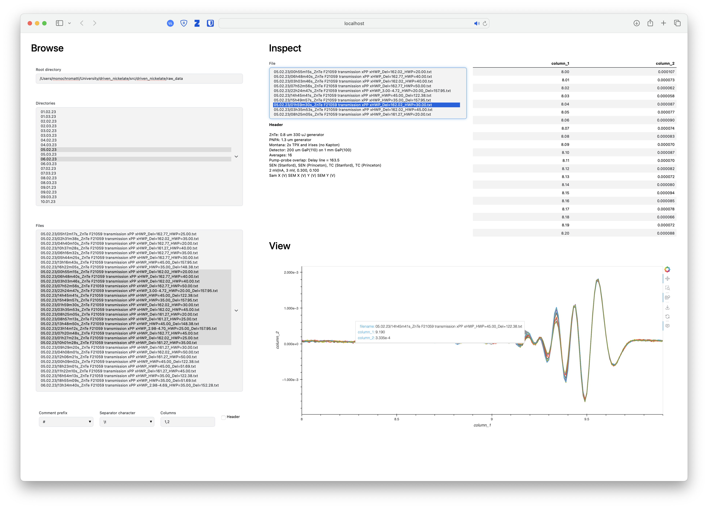

# Data viewer

A simple app for quick exploration of tabular data files. I used this as an experimental researcher, for quick looks at the raw data. The viewer is built using [Panel](https://panel.holoviz.org/), a high-level app and dashboarding solution for Python.

## Installation

Clone the repository and create a new conda environment with the required packages.

```console
> conda create -n data_explorer
> conda activate data_explorer
> conda install --file requirements.txt
```
## Run

To run the application, use `panel serve`, which opens it in your default browser.

```console
> panel serve data_browser.py --show
```

## Screenshot

